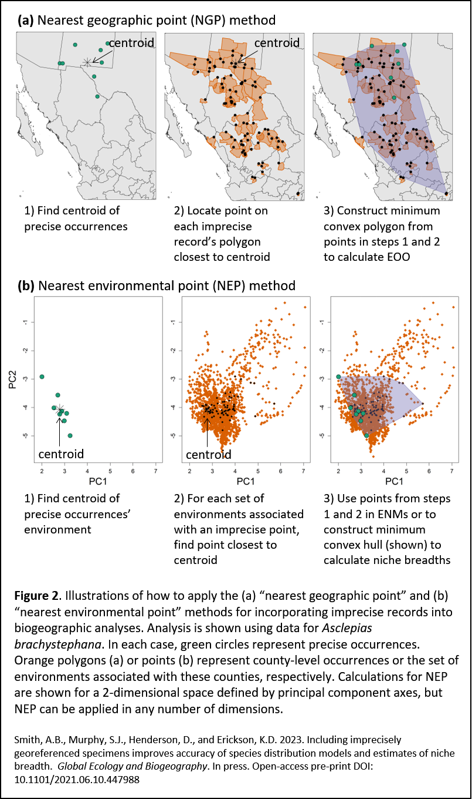

# enms_impreciseRecords
What is the cost of discarding imprecisely-georeferenced specimens from evaluations of species' climate change vulnerability? This repository contains the code used to generate and evaluate the effect of including spatially imprecise specimens when estimating species niches and distributions. The full citation for this work is:

Smith, A.B., Murphy, S.J., Henderson, D., and Erickson, K.D. 2023. Including imprecisely georeferenced specimens improves accuracy of species distribution models and estimates of niche breadth.  <i>Global Ecology and Biogeography</i> In press. <a href="http://dx.doi.org/10.1101/2021.06.10.447988">Open access pre-print.</a>

### Abstract ###
<strong>Aim</strong> Museum and herbarium specimen records are frequently used to assess species’ conservation status and responses to climate change. Typically, occurrences with imprecise geolocality information are discarded because they cannot be matched confidently to environmental conditions, and are thus expected to increase uncertainty in downstream analyses. However, using only precisely georeferenced records risks undersampling of species’ environmental and geographic distributions. We present two related methods to allow the use of imprecisely georeferenced occurrences in biogeographic analysis.

<strong>Innovation</strong>: Our two procedures assign imprecise records to the 1) locations or 2) climates that are closest to the geographic or environmental centroid of the precise records of a species. For virtual species, including imprecise records alongside precise records improved the accuracy of ecological niche models projected to the present and the future, especially for species with ~20 or fewer precise occurrences. Using only precise records underestimates loss in suitable habitat and overestimates the amount of suitable habitat in both the present and future. Including imprecise records also improves estimates of niche breadth and extent of occurrence. An analysis of 44 species of North American <i>Asclepias</i> (Apocynaceae) yielded similar results.

<strong>Main conclusions</strong>: Existing studies examining the effects of spatial imprecision compare outcomes based on precise records to the same records with spatial error added to them. However, in real-world cases, analysts possess a mix of precise and imprecise records and must decide whether to retain or discard the latter. Discarding imprecise records can undersample species’ geographic and environmental distributions and lead to mis-estimation of responses to past and future climate change. Our method, for which we provide a software implementation in the enmSdmX package for R, is simple to employ and can help leverage the large number of specimen records that are typically deemed “unusable” because of spatial imprecision in their geolocation.

### Illustration ###
Imprecise records can be included in biogeographic analyses using two methods presented in the paper, the "nearest geographic point" (NGP) and "nearest environmental point" (NEP) methods:

